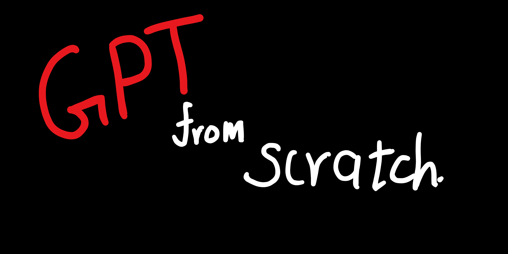
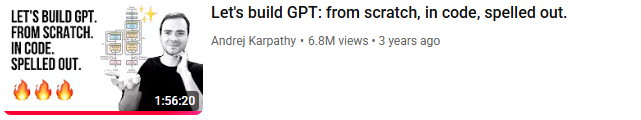
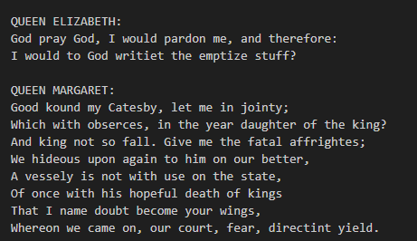
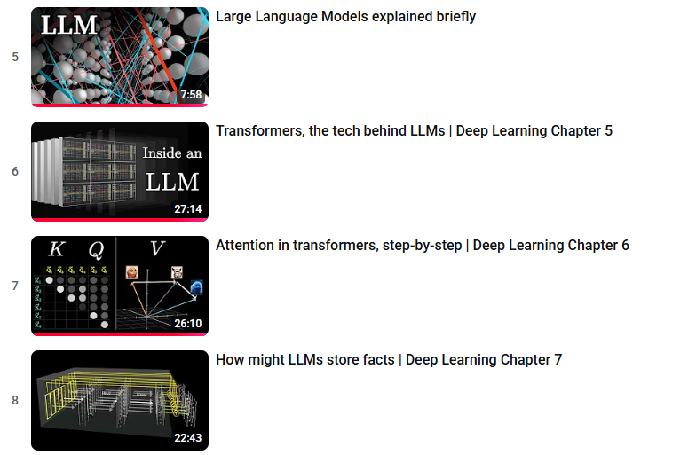

# Nano-GPT: A Shakespearean Transformer
Code following the YT tutorial of Andrej Karpathy.

## About the project:
This is a ground-up implementation of Generative Pretrained Model that was built following the YouTube lecture of Andrej Karpathy. 

Video Link: [Let's build GPT: from scratch, in code, spelled out.](https://www.youtube.com/watch?v=kCc8FmEb1nY)

## Techinal Highlights:
**Architecture**: Decoder-only Transformer.  
**Scaling**: Implemented a multi-layer stack with $6$ heads and an embedding dimension of $384$.  
**Normalization:** Manual implementation of LayerNorm to ensure training stability across deep layers.  

## Training Results:
The model was trained on the Tiny Shakespeare dataset for approximately 25 minutes on an **NVIDIA RTX 3060** Laptop GPU.

**Final Training Loss:** 1.0163  
**Final Validation Loss:** 1.7527  

  

## Sample Output:

## Additional resources:

For a more visual and conceptual understanding I found the follwoing videos by 3B1B very helful:
1. [Large Language Models explained briefly](https://youtu.be/LPZh9BOjkQs?si=Fsj3nRLNQacMa8RW)
2. [Transformers, the tech behind LLMs | Deep Learning Chapter 5](https://youtu.be/wjZofJX0v4M?si=Ed_RwkcFFooyp8DB)
3. [Attention in transformers, step-by-step | Deep Learning Chapter 6](https://youtu.be/eMlx5fFNoYc?si=lccXbCjrCkLt_s9c)
4. [How might LLMs store facts | Deep Learning Chapter 7](https://youtu.be/9-Jl0dxWQs8?si=O-Jw1IV-P_EjZjS0)  

